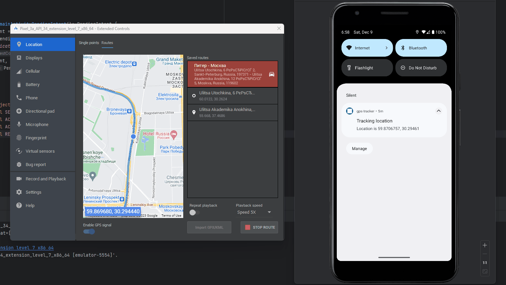

# gps-tracker

## Что здесь происходит
1. Кнопка Start tracking, после получения необходимых разрешений, запускает Foreground service.
2. Сервис каждые 2 секунды запрашивает координаты текущего местоположения  
3. Текущие координаты сохраняются в LocationStore (реализованный на базе SharedPreferences)
4. MainViewModel подписывается на координаты в LocationStore и передает их в Composable функцию MainScreen
5. MainScreen использует Яндекс карту для показа текущего местоположения 
6. Кнопка Stop tracking останавливает Foreground service

## Карта

## Уведомление 

